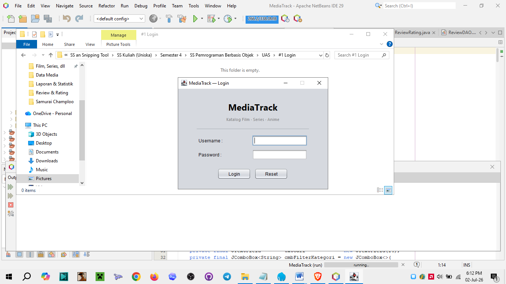
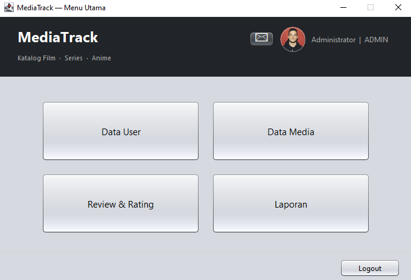
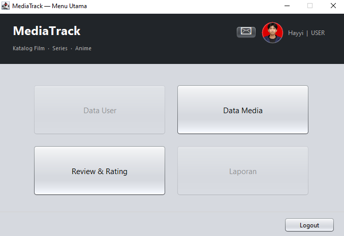
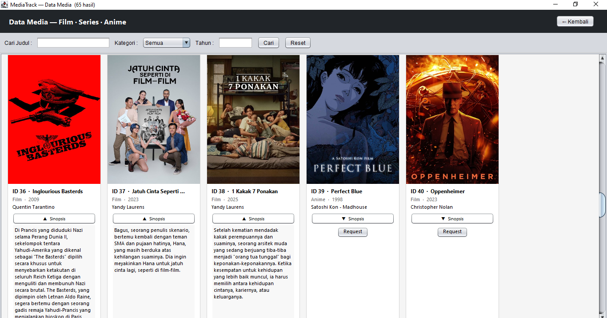
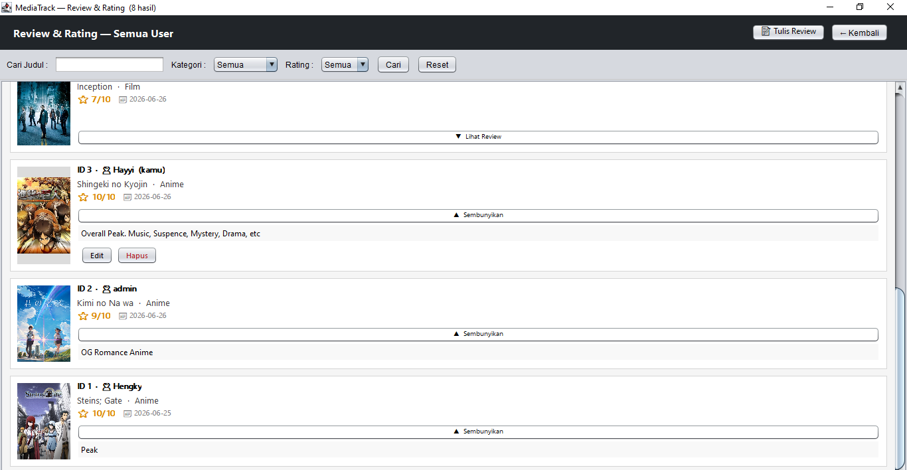
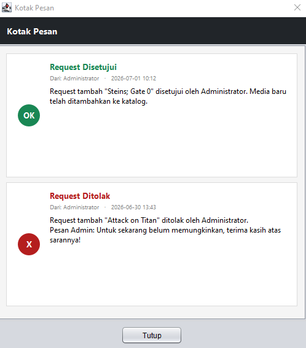
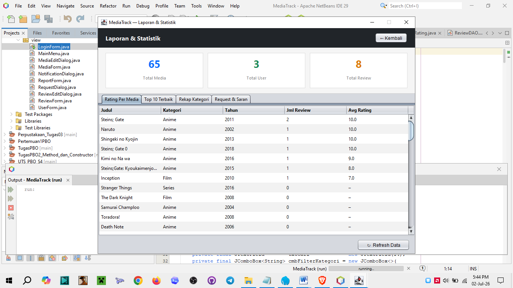
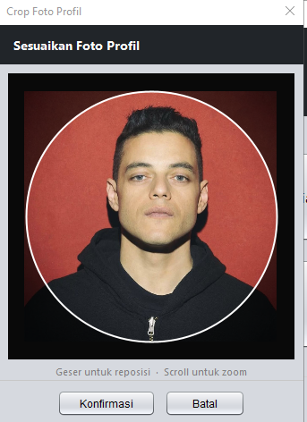
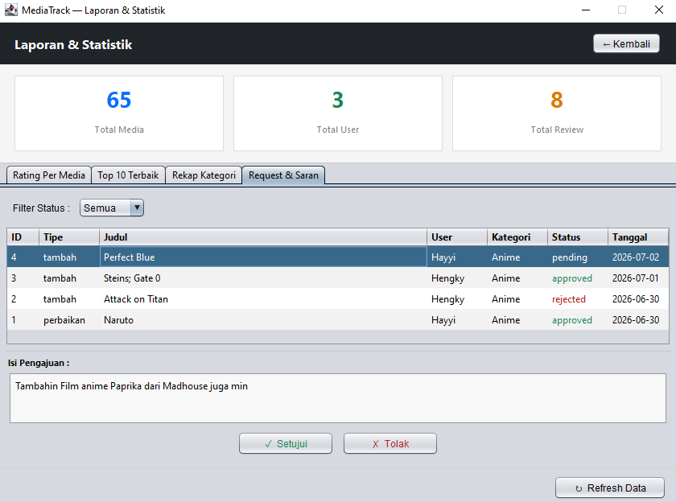

<div align="center">

# 🎬 MediaTrack

**Sistem Katalog Film, Series & Anime dengan Review Pengguna**

Aplikasi desktop berbasis Java Swing untuk mengelola katalog media, menulis review, memberi rating, dan berinteraksi antara pengguna dan administrator.

[](https://adoptium.net)
[](https://www.mysql.com)
[](https://netbeans.apache.org)
[](https://dev.mysql.com/downloads/connector/j/)
[](.)

---



</div>

---

## Tampilan Aplikasi

<details>
<summary>📸 Lihat semua screenshot</summary>

<br>

| Menu Utama (Admin)                        | Menu Utama (User)                       |
| ----------------------------------------- | --------------------------------------- |
|  |  |

| Data Media — Kartu Visual                 | Review & Rating                   |
| ----------------------------------------- | --------------------------------- |
|  |  |

| Inbox Notifikasi                | Laporan & Statistik                 |
| ------------------------------- | ----------------------------------- |
|  |  |

| Crop Foto Profil              | Tab Request & Saran                 |
| ----------------------------- | ----------------------------------- |
|  |  |

</details>

---

## Fitur Utama

### Fitur Bersama (Admin & User)

- **Katalog Media Visual** — tampilan kartu dengan poster dari internet, expand sinopsis
- **Review & Rating** — tulis, ubah, hapus review; semua review publik terlihat oleh semua user
- **Search & Filter** — cari judul, filter kategori (Film/Series/Anime), filter tahun/rating
- **Profile Picture** — foto profil custom dengan crop interaktif, tersimpan di database
- **Inbox Notifikasi** — kotak pesan dengan badge jumlah belum dibaca

### Fitur Admin

- **CRUD User** — kelola akun pengguna, proteksi hapus akun sendiri
- **CRUD Media** — tambah, edit, hapus media termasuk poster URL
- **Laporan 4 Tab** — Rating Per Media · Top 10 Terbaik · Rekap Kategori · Request & Saran
- **Approve / Reject Request** — setujui atau tolak request user dengan pesan opsional

### Fitur User

- **Request Media** — ajukan tambah media baru atau laporkan kekeliruan data ke admin
- **Proteksi Edit** — hanya bisa ubah/hapus review milik sendiri

### Tabel Hak Akses

| Fitur                                | Admin |     User      |
| ------------------------------------ | :---: | :-----------: |
| Data User (CRUD)                     |  ✅   |      ❌       |
| Data Media (CRUD)                    |  ✅   | 👁 Lihat saja |
| Request Media ke Admin               |  ❌   |      ✅       |
| Review & Rating (CRUD milik sendiri) |  ✅   |      ✅       |
| Hapus Review User Lain               |  ✅   |      ❌       |
| Laporan & Statistik                  |  ✅   |      ❌       |
| Approve / Reject Request             |  ✅   |      ❌       |
| Profile Picture                      |  ✅   |      ✅       |
| Inbox Notifikasi                     |  ✅   |      ✅       |

---

## Tech Stack

| Komponen     | Teknologi               |
| ------------ | ----------------------- |
| Bahasa       | Java 25 (OpenJDK)       |
| UI Framework | Java Swing (Nimbus L&F) |
| Database     | MySQL 8.0.30            |
| JDBC Driver  | MySQL Connector/J 9.7.0 |
| IDE          | Apache NetBeans 29      |
| Build Tool   | Apache Ant              |

---

## Persyaratan

Sebelum menjalankan project, pastikan sudah terinstal:

- **JDK 17+** (direkomendasikan JDK 21 LTS atau 25 LTS) — [Download](https://adoptium.net)
- **MySQL 8.0+** — [Download](https://dev.mysql.com/downloads/mysql/)
- **Apache NetBeans 17+** — [Download](https://netbeans.apache.org/front/main/download/)
- **MySQL Connector/J 9.x** — [Download](https://dev.mysql.com/downloads/connector/j/)
- **Koneksi internet** _(untuk load poster media dari URL)_

---

## Instalasi

### 1. Clone Repository

```bash
git clone https://github.com/username/MediaTrack.git
cd MediaTrack
```

### 2. Setup Database

Buka HeidiSQL / MySQL Workbench, lalu jalankan script berikut:

```sql
CREATE DATABASE IF NOT EXISTS mediatrack_db
  CHARACTER SET utf8mb4
  COLLATE utf8mb4_unicode_ci;

USE mediatrack_db;

CREATE TABLE users (
    id_user      INT AUTO_INCREMENT PRIMARY KEY,
    username     VARCHAR(50)  NOT NULL UNIQUE,
    password     VARCHAR(255) NOT NULL,
    nama_lengkap VARCHAR(100) NOT NULL,
    role         ENUM('admin', 'user') NOT NULL DEFAULT 'user',
    profile_pic  LONGBLOB DEFAULT NULL,
    created_at   TIMESTAMP DEFAULT CURRENT_TIMESTAMP
);

CREATE TABLE media (
    id_media         INT AUTO_INCREMENT PRIMARY KEY,
    judul            VARCHAR(200) NOT NULL,
    kategori         ENUM('Film', 'Series', 'Anime') NOT NULL,
    tahun_rilis      YEAR NOT NULL,
    sutradara_studio VARCHAR(100),
    deskripsi        TEXT,
    image_url        VARCHAR(500) DEFAULT NULL,
    created_at       TIMESTAMP DEFAULT CURRENT_TIMESTAMP
);

CREATE TABLE review_rating (
    id_review      INT AUTO_INCREMENT PRIMARY KEY,
    id_user        INT     NOT NULL,
    id_media       INT     NOT NULL,
    rating         TINYINT NOT NULL,
    review         TEXT,
    tanggal_review DATE    DEFAULT (CURRENT_DATE),
    CONSTRAINT chk_rating  CHECK (rating BETWEEN 1 AND 10),
    CONSTRAINT fk_rr_user  FOREIGN KEY (id_user)
        REFERENCES users(id_user)  ON DELETE CASCADE ON UPDATE CASCADE,
    CONSTRAINT fk_rr_media FOREIGN KEY (id_media)
        REFERENCES media(id_media) ON DELETE CASCADE ON UPDATE CASCADE
);

CREATE TABLE media_request (
    id_request    INT AUTO_INCREMENT PRIMARY KEY,
    id_user       INT NOT NULL,
    tipe          ENUM('tambah', 'perbaikan') NOT NULL,
    judul         VARCHAR(200) NOT NULL,
    kategori      ENUM('Film', 'Series', 'Anime'),
    isi_pengajuan TEXT NOT NULL,
    id_media_ref  INT DEFAULT NULL,
    status        ENUM('pending', 'approved', 'rejected') DEFAULT 'pending',
    created_at    TIMESTAMP DEFAULT CURRENT_TIMESTAMP,
    FOREIGN KEY (id_user)      REFERENCES users(id_user)  ON DELETE CASCADE,
    FOREIGN KEY (id_media_ref) REFERENCES media(id_media) ON DELETE SET NULL
);

CREATE TABLE notifications (
    id_notif     INT AUTO_INCREMENT PRIMARY KEY,
    id_user_to   INT NOT NULL,
    id_user_from INT NOT NULL,
    judul_notif  VARCHAR(100) NOT NULL,
    isi          TEXT,
    tipe         ENUM('approved', 'rejected', 'info') DEFAULT 'info',
    is_read      TINYINT(1) DEFAULT 0,
    created_at   TIMESTAMP DEFAULT CURRENT_TIMESTAMP,
    FOREIGN KEY (id_user_to)   REFERENCES users(id_user) ON DELETE CASCADE,
    FOREIGN KEY (id_user_from) REFERENCES users(id_user) ON DELETE CASCADE
);

-- Seed: akun default
INSERT INTO users (username, password, nama_lengkap, role) VALUES
  ('admin', 'admin123', 'Administrator', 'admin');
```

### 3. Konfigurasi Koneksi Database

Buka `src/config/DBConnection.java`, sesuaikan kredensial MySQL:

```java
private static final String URL =
    "jdbc:mysql://localhost:3306/mediatrack_db"
    + "?useSSL=false&allowPublicKeyRetrieval=true&serverTimezone=UTC";

private static final String USER = "root";
private static final String PASS = "";  // ← isi jika MySQL root punya password
```

### 4. Tambahkan Library

1. Ekstrak `mysql-connector-j-9.7.0.zip`
2. Ambil file `mysql-connector-j-9.7.0.jar`
3. Di NetBeans: klik kanan project → **Properties** → **Libraries** → **Add JAR/Folder**
4. Arahkan ke file `.jar` tersebut → **OK**

### 5. Jalankan Aplikasi

- Set main class: klik kanan project → **Properties** → **Run** → **Main Class**: `view.LoginForm`
- Tekan `F6` atau klik **Run Project**

---

## Akun Default

| Username | Password   | Role          |
| -------- | ---------- | ------------- |
| `admin`  | `admin123` | Administrator |

> **Catatan:** Buat akun user baru lewat menu **Data User** setelah login sebagai admin.

---

## Struktur Project

```
MediaTrack/
├── src/
│   ├── config/
│   │   ├── DBConnection.java       ← koneksi singleton ke MySQL
│   │   └── Session.java            ← menyimpan user yang sedang login
│   ├── model/
│   │   ├── User.java
│   │   ├── Media.java
│   │   ├── ReviewRating.java
│   │   ├── MediaRequest.java
│   │   └── Notification.java
│   ├── dao/
│   │   ├── UserDAO.java            ← CRUD + profile pic
│   │   ├── MediaDAO.java           ← CRUD + search/filter
│   │   ├── ReviewDAO.java          ← CRUD + search/filter
│   │   ├── MediaRequestDAO.java    ← request management
│   │   ├── NotificationDAO.java    ← inbox system
│   │   └── ReportDAO.java          ← laporan & statistik
│   └── view/
│       ├── LoginForm.java
│       ├── MainMenu.java           ← avatar + notif badge
│       ├── UserForm.java
│       ├── MediaForm.java          ← card UI + responsive grid
│       ├── MediaEditDialog.java
│       ├── ReviewForm.java         ← card UI + filter
│       ├── ReviewEditDialog.java
│       ├── RequestDialog.java
│       ├── ReportForm.java         ← 4 tab laporan
│       ├── NotificationDialog.java
│       └── AvatarCropDialog.java   ← drag & scroll crop
└── lib/
    └── mysql-connector-j-9.7.0.jar
```

---

## Lisensi

Project ini dibuat untuk memenuhi tugas mata kuliah **Pemrograman Berbasis Objek** — Teknik Informatika.

---

<div align="center">

Dibuat dengan ☕ Java & 🎬 semangat nonton

</div>
